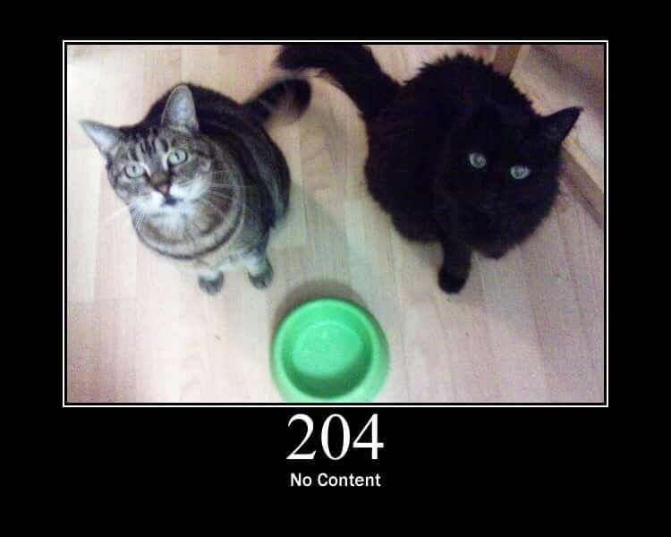

# HTTP Cats · refined

[](LICENSE)
[](https://nextjs.org/)
[](https://www.typescriptlang.org/)
[](https://tailwindcss.com/)
[](#languages)

📖 README: **English** | **[简体中文](docs/README.zh-CN.md)** | **[繁體中文](docs/README.zh-TW.md)** | **[日本語](docs/README.ja.md)** | **[Français](docs/README.fr.md)** | **[Русский](docs/README.ru.md)** | **[Español](docs/README.es.md)**

🌐 Live demo: **[hcr.cialo.site](https://hcr.cialo.site)**



**HTTP Cats · refined** is a multilingual HTTP status code reference site built with Next.js. It covers 120+ status codes — including standard RFC codes, Nginx 4xx extensions, Cloudflare 5xx, and the full Cloudflare 1xxx error series — each illustrated with a cat picture, organized by category, and translated into seven languages. A refined fork of [httpcats/http.cat](https://github.com/httpcats/http.cat).

## Highlights

- 🌏 **Multilingual** — Full UI and per-status-code descriptions in 7 languages, with automatic fallback to English when a translation is missing
- 📊 **120+ status codes** — Standard codes missing from the original (505, etc.), Nginx extensions (444, 494–499), Cloudflare 5xx (520–527, 530), and all Cloudflare 1xxx errors (1000–1201)
- 🗂️ **Category tabs** — Codes grouped by class (1xx / 2xx / 3xx / 4xx / 5xx / Cloudflare 1xxx) with descriptions
- 🖼️ **Image fallback** — Codes without dedicated images use a graceful placeholder
- ✨ **Cleaner UI** — Ads removed, social cruft trimmed, frosted-glass language switcher

## Languages

| Locale | Language | Path |
|--------|----------|------|
| `en` | English | `/` |
| `zh-CN` | 简体中文 | `/zh-CN` |
| `zh-TW` | 繁體中文 | `/zh-TW` |
| `ja` | 日本語 | `/ja` |
| `fr` | Français | `/fr` |
| `ru` | Русский | `/ru` |
| `es` | Español | `/es` |

PRs welcome for additional languages. See [Adding a new language](#adding-a-new-language).

## Development

### Prerequisites

- Node.js 18+
- npm

### Getting started

```bash
npm install
npm run dev
```

The app will be available at `http://localhost:3000`.

### Building for production

```bash
npm run build
```

Static files are exported to `/out`.

### Routes

| Path | Language |
|------|----------|
| `/` | English |
| `/zh-CN` | 简体中文 |
| `/zh-TW` | 繁體中文 |
| `/ja` | 日本語 |
| `/fr` | Français |
| `/ru` | Русский |
| `/es` | Español |
| `/status/<code>` | Status detail (English) |
| `/<locale>/status/<code>` | Status detail (localized) |

## Tech stack

| | |
|---|---|
| Framework | Next.js 16 (App Router, static export) |
| UI | React 19 + Tailwind CSS |
| Language | TypeScript |
| Content | Markdown (remark + rehype) |

## Adding a new status code

1. Add an entry to `lib/statuses.js`:

```js
505: {
  code: 505,
  message: 'HTTP Version Not Supported',
  messageI18n: {
    'zh-CN': '不支持的 HTTP 版本',
    'zh-TW': '不支援的 HTTP 版本',
    ja: 'サポートされていない HTTP バージョン',
    fr: 'Version HTTP non prise en charge',
    ru: 'Версия HTTP не поддерживается',
    es: 'Versión HTTP no soportada',
  },
  hasImage: false,
},
```

2. Add an English description at `content/en/<code>.md`
3. Add localized descriptions at `content/<locale>/<code>.md` for each supported language (missing locales fall back to English)
4. If you have a cat image, place it in `public/images/` and `public/images-original/`, then set `hasImage: true`

## Adding a new language

Use `<locale>` for a BCP 47 code (e.g. `de`, `ko`, `pt-BR`).

1. **Content** — create `content/<locale>/<code>.md` for every status code (translate from `content/en/`)
2. **UI strings** — copy `locales/en/common.json` to `locales/<locale>/common.json`, change `LOCALE` to the new code, translate the values
3. **Status code names** *(optional)* — add a `<locale>` key to each entry's `messageI18n` in `lib/statuses.js`. Status detail headings will show this as a subtitle. Skip this step and only the English name will render
4. **Routes** — create `app/<locale>/page.tsx` and `app/<locale>/status/[status]/page.tsx` (copy from an existing locale and replace the `getTranslations` argument, link paths, OG locale, and description template)
5. **Switcher** — add a row to `LANGUAGES` in `components/LanguageSwitcher/LanguageSwitcher.tsx`
6. **SEO** — in `app/layout.tsx`:
   - add the locale to `metadata.alternates.languages`
   - add the locale to the inline `<html lang>` IIFE map
7. **Site-wide locale config** — in `lib/locale.ts`:
   - add the locale to `SUPPORTED_LOCALES`
   - add the locale to `HREFLANG_MAP` (this powers `buildHrefLangMap()` used by every detail page; no per-page wiring needed)
8. **README** — write `docs/README.<locale>.md` and add the locale to the navigation row + Languages table in every existing README
9. **GitHub repo** — append the language to the About description and add a topic for the language
10. **Sitemap** — regenerate `public/sitemap.xml`

## Credits

Thanks to [@girliemac](https://github.com/girliemac) for creating the amazing HTTP status cats images.

Thanks to [@pfdborges](https://github.com/pfdborges) for creating the http.cat logo (RIP 🕯️).

Original project by [@rogeriopvl](https://github.com/rogeriopvl).

## License

MIT
